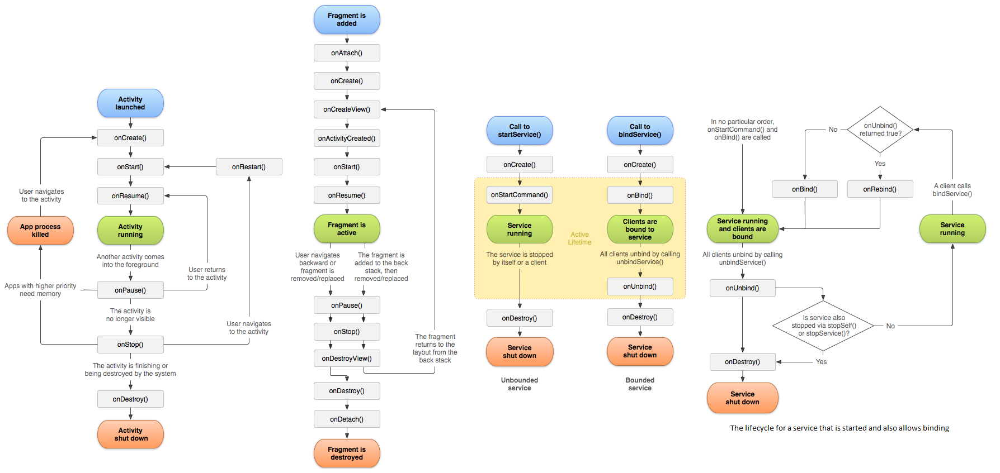

# Android Knowledge

## Activity & Fragment lifecycle
  

* Activity在屏幕旋转时的生命周期  
    android:configChanges="keyboardHidden|orientation|screenSize": onConfigurationChagned  
    Without above: Old activity is destroyed and a new one is created
* 介绍不同场景下Activity生命周期的变化过程
    - 启动： onCreate()—>onStart()—>onResume()，Activity进入运行状态。
    - 退居后台：当前Activity转到新的Activity界面或按Home键回到主屏：onPause()—>onStop()
    - 返回前台：onRestart()—>onStart()—>onResume()，再次回到运行状态。
    - 退居后台，且系统内存不足， 系统会杀死这个后台状态的Activity，若再次回到这个Activity,则会走onCreate()–>onStart()—>onResume()
    - 锁定屏与解锁屏幕 只会调用onPause()，而不会调用onStop方法，开屏后则调用onResume()
* 两个Activity之间跳转时，生命周期的执行顺序
    - A跳转到B时的执行顺序  
        A.onPause() > B.onCreate() > B.onStart() > B.onResume() > A.onStop()
    - 按返回按钮由B返回到A时的执行顺序  
        B.onPause() > A.onRestart() > A.onStart() > A.onResume() > B.onStop() > B.onDestroy()
* onSaveInstanceState  
    called before onStop() but no guarantee before or after onPause()
* onRestoreInstanceState  
    called between onStart() and onPostCreate(Bundle)
* Fragment 状态的保存及恢复  
    onSaveInstanceState onActivityCreated setRetainInstance(true)
* 退出多Activity的App的方式
    - 利用ActivityContainer管理所有的Activity引用
    - 使用广播通知BaseActivity结束
    - 直接杀死进程
    - 采用SingleTask的特点，Kill Root activity, 结束应用
* Activity与Service通信
    - Broadcast:
    - Binder: 自有Service，extends Binder
        ```
        Service
            LocalBinder extends Binder
                Service getService() 
                    return Service.this
            IBinder mBinder = new LocalBinder()
            @Override IBinder onBinder(Intent intent)
                return mBinder
        Activity
            bindService(intent, new ServiceConnection() {
                void onServiceConnected(ComponentName className, IBinder service)
                    LocalBinder binder = (LocalBinder) service;
                    mService = binder.getService();
            }, Context.BIND_AUTO_CREATE)
        ```
    - Messenger: 跨进程，定义对应于不同类型Message对象的Handler
        ```
        Service 
            LocalHandler extends Handler
            Messenger m = new Messenger(new LocalHandler())
            @Override IBinder onBind(Intent intent)
                return m.getBinder()
        Activity
            bindService(intent, new ServiceConnection() {
                void onServiceConnected(ComponentName className, IBinder service)
                    mService = new Messenger(service)
            }, Context.BIND_AUTO_CREATE)
        ```
    - AIDL: 
* IntentService  
    Clients send requests through startService(Intent) calls; the service is started as needed, handles each Intent in turn using a worker thread, and stops itself when it runs out of work.
    
## 内存泄漏 & UI优化
* Android 内存泄漏总结
    - Java中非静态内部类和匿名内部类会持有外部类的引用 Message keeps activity reference
    - 单例造成的内存泄漏
    - 非静态内部类创建静态实例造成的内存泄漏: Static references activity
    - Handler造成的内存泄漏，Handler的生命周期比外部类长。
    - 线程造成的内存泄漏: Activity在销毁之前，任务还未完成
    - 资源未关闭造成的内存泄漏
* Android UI性能优化
    - 合理选择控件容器: LinearLayout易用，效率高，表达能力有限。RelativeLayout复杂，表达能力强，效率稍逊
    - 去掉window的默认背景
    - 去掉其他不必要的背景
    - ClipRect & QuickReject: 通过canvas.clipRect()来帮助系统识别那些可见的区域
    - ViewStub: 高效占位符
    - Merge: 干掉一个view层级
    - 善用draw9patch
    - 慎用Alpha
    - 避免“OverDesign”

* 四大组件  
    Activity, Service, ContentProvider, BroadcastReceiver
* 常用布局  
    Frame, Linear, Absolute, Relative, Table, Constraint
